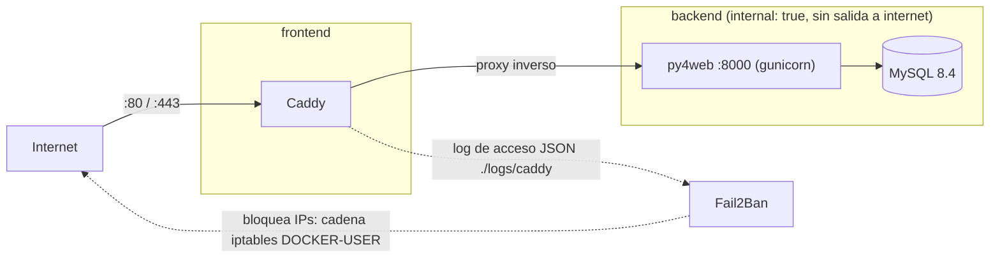

# py4web + Caddy + MySQL + Fail2Ban (Docker)

[English](README.md) | **Español**

[](https://github.com/jparga/py4web-docker-with-example-caddy/actions/workflows/ci.yml)
[](LICENSE)

## Qué es

Plantilla lista para producción para ejecutar una aplicación [py4web](https://py4web.com) con Docker Compose: py4web (gunicorn) detrás de [Caddy](https://caddyserver.com) con HTTPS automático, MySQL 8.4 como base de datos y Fail2Ban opcional que bloquea IPs abusivas. Incluye una `example_app` mínima (MySQL mediante variables de entorno, un endpoint `/health` y un contador anónimo de visitas) que puedes sustituir por tu propia aplicación.

## Arquitectura



- Redes: `frontend` (Caddy, puertos publicados) y `backend` (`internal: true`: py4web y MySQL no tienen salida a internet).
- Caddy escribe un log de acceso JSON en `./logs/caddy`; Fail2Ban lo lee y bloquea IPs mediante la cadena `DOCKER-USER` de iptables.

## Estructura del repositorio

```
.
├── Dockerfile                 # imagen python:3.13-slim, usuario sin privilegios
├── docker-compose.yml         # py4web, caddy, db, fail2ban (perfil)
├── docker/entrypoint.sh       # arranque de py4web (gunicorn, dashboard)
├── caddy/Caddyfile            # un único fichero dirigido por DOMAIN
├── fail2ban/
│   ├── filter.d/              # caddy-py4web-auth, caddy-py4web-scan
│   └── jail.d/                # jails
├── apps/example_app/          # aplicación py4web de ejemplo
├── deploy.sh                  # actualizar y reconstruir en el servidor
├── .env.example               # plantilla de configuración
└── requirements.txt           # dependencias Python fijadas
```

## Requisitos

- Docker Engine con Compose v2.
- Para Fail2Ban: un host Linux con iptables.

## Inicio rápido (local)

```bash
cp .env.example .env
# Define las contraseñas (sustituye cada <CHANGE_ME>):
openssl rand -base64 32
docker compose up -d --build --wait
```

Abre http://localhost: redirige a `/example_app/index`. El endpoint de salud en http://localhost/example_app/health devuelve `{"status": "ok"}`.

## Despliegue en producción

1. Crea un registro DNS `A`/`AAAA` que apunte a tu servidor.
2. En `.env`, define `DOMAIN=example.com`. Caddy obtiene automáticamente un certificado de Let's Encrypt.
3. Para activar Fail2Ban, descomenta `COMPOSE_PROFILES=fail2ban` en `.env`.
4. Despliega:

```bash
./deploy.sh [branch]
```

`deploy.sh`:

- exige que exista `.env`;
- ejecuta `git fetch` y `git merge --ff-only origin/<branch>` (por defecto `master`);
- ejecuta `docker compose pull --ignore-buildable`;
- ejecuta `docker compose up -d --build --remove-orphans --wait`;
- ejecuta `docker image prune -f`.

## Configuración

Variables de `.env.example`:

| Variable | Por defecto | Descripción |
|---|---|---|
| `DOMAIN` | `http://localhost` | Dominio público (HTTPS automático) o `http://localhost` para pruebas locales. |
| `MYSQL_ROOT_PASSWORD` | `<CHANGE_ME>` | Contraseña de root de MySQL. Obligatoria. |
| `MYSQL_DATABASE` | `py4web` | Nombre de la base de datos. |
| `MYSQL_USER` | `py4web` | Usuario de base de datos de la aplicación. |
| `MYSQL_PASSWORD` | `<CHANGE_ME>` | Contraseña del usuario de la aplicación. Obligatoria. |
| `PY4WEB_WORKERS` | `2` | Número de workers de gunicorn. |
| `PY4WEB_DASHBOARD_MODE` | `none` | `none`, `readonly` o `full`. |
| `PY4WEB_DASHBOARD_PASSWORD` | vacío | Obligatoria si el modo no es `none`. |
| `COMPOSE_PROFILES` | comentada | Pon `fail2ban` para activar Fail2Ban. |
| `TZ` | `UTC` | Zona horaria de Fail2Ban. |

La aplicación de ejemplo lee además estas variables de entorno opcionales:

| Variable | Por defecto | Descripción |
|---|---|---|
| `DB_URI` | construida con `MYSQL_*` | URI completa de la base de datos (usuario y contraseña codificados como URL). Prevalece sobre todo lo demás. |
| `DB_HOST` | `db` | Host de la base de datos. |
| `DB_PORT` | `3306` | Puerto de la base de datos. |
| `DB_POOL_SIZE` | `5` | Tamaño del pool de conexiones. |
| `DB_MIGRATE` | `true` | Ejecutar migraciones de PyDAL. |
| `LOG_LEVEL` | `INFO` | Nivel de log. |

También puedes crear un `apps/example_app/settings_private.py` opcional, ignorado por git (parte de `settings_private.example.py`).

## Añadir tu propia aplicación

1. Crea `apps/<tu_app>`.
2. Añade la línea `COPY` correspondiente en el `Dockerfile`.
3. Añade la línea `!apps/<tu_app>/` en `.dockerignore`.
4. Si usa migraciones, añade un volumen para su carpeta `databases/` en `docker-compose.yml`.

## Dashboard de py4web

El dashboard está desactivado por defecto. Para activarlo, define `PY4WEB_DASHBOARD_MODE` (`readonly` o `full`) y `PY4WEB_DASHBOARD_PASSWORD` en `.env`. Queda accesible en `/_dashboard`.

Aviso: el dashboard es una interfaz de administración muy potente. Limita quién puede acceder (por ejemplo por IP en Caddy o mediante VPN) y usa una contraseña robusta.

## Fail2Ban

Se activa con `COMPOSE_PROFILES=fail2ban`. Jails:

| Jail | Regla | Bloqueo |
|---|---|---|
| `caddy-py4web-auth` | 5 respuestas 401/403 en 10 minutos | 1 hora |
| `caddy-py4web-scan` | 20 respuestas 404 en 1 minuto | 6 horas |

Los rangos privados se ignoran.

```bash
docker compose exec fail2ban fail2ban-client status caddy-py4web-auth
docker compose exec fail2ban fail2ban-client set caddy-py4web-auth unbanip <IP>
```

Advertencia: si el sitio está detrás de una CDN o un proxy como Cloudflare, configura `trusted_proxies` en Caddy; de lo contrario, los bloqueos recaerán sobre las IPs del proxy y no sobre los clientes reales.

## Datos persistentes

Volúmenes con nombre:

| Volumen | Contenido |
|---|---|
| `py4web_service` | secreto de sesión de py4web y tickets de error |
| `py4web_databases` | ficheros de migración de PyDAL |
| `mysql_data` | datos de MySQL |
| `caddy_data` | certificados TLS |
| `caddy_config` | configuración de Caddy |

Ejemplo de copia de seguridad:

```bash
docker compose exec db sh -c 'exec mysqldump -uroot -p"$MYSQL_ROOT_PASSWORD" --single-transaction "$MYSQL_DATABASE"' > backup.sql
```

## Notas de seguridad

- El contenedor se ejecuta con un usuario sin privilegios (uid 1000) y `no-new-privileges`.
- Los secretos viven solo en `.env` (ignorado por git).
- Caddy envía cabeceras de seguridad: HSTS, `X-Content-Type-Options: nosniff`, `X-Frame-Options: DENY`, `Referrer-Policy` y `Permissions-Policy`; se elimina la cabecera `Server`.
- Las versiones de las imágenes y de las dependencias Python están fijadas y las actualiza Dependabot.

Consulta [SECURITY.md](SECURITY.md) para informar de vulnerabilidades.

## Desarrollo local sin Docker

```bash
python -m venv .venv
source .venv/bin/activate
pip install -r requirements.txt
py4web run apps
```

Sin las variables de MySQL, la aplicación usa SQLite.

## Contribuir

Consulta [CONTRIBUTING.es.md](CONTRIBUTING.es.md) y el [Código de conducta](CODE_OF_CONDUCT.md).

## Licencia

[MIT](LICENSE) - Jacinto Parga.
