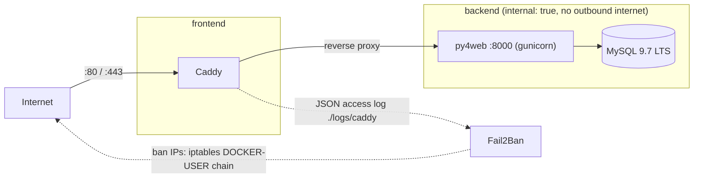

# py4web + Caddy + MySQL + Fail2Ban (Docker)

**English** | [Español](README.es.md)

[](https://github.com/jparga/py4web-docker-with-example-caddy/actions/workflows/ci.yml)
[](LICENSE)

## What it is

A production-ready template to run a [py4web](https://py4web.com) application with Docker Compose: py4web (gunicorn) behind [Caddy](https://caddyserver.com) with automatic HTTPS, MySQL 9.7 LTS as the database, and optional Fail2Ban that bans abusive IPs. It ships with a small `example_app` (MySQL via environment variables, a `/health` endpoint and an anonymous page-view counter) that you can replace with your own app.

## Architecture



- Networks: `frontend` (Caddy, published ports) and `backend` (`internal: true`: py4web and MySQL have no outbound internet access).
- Caddy writes a JSON access log to `./logs/caddy`; Fail2Ban reads it and bans IPs through the `DOCKER-USER` iptables chain.

## Repository layout

```
.
├── Dockerfile                 # python:3.13-slim image, non-root user
├── docker-compose.yml         # py4web, caddy, db, fail2ban (profile)
├── docker/entrypoint.sh       # py4web start-up (gunicorn, dashboard)
├── caddy/Caddyfile            # single file driven by DOMAIN
├── fail2ban/
│   ├── filter.d/              # caddy-py4web-auth, caddy-py4web-scan
│   └── jail.d/                # jails
├── apps/example_app/          # sample py4web application
├── deploy.sh                  # update + rebuild on the server
├── .env.example               # configuration template
└── requirements.txt           # pinned Python dependencies
```

## Requirements

- Docker Engine with Compose v2.
- For Fail2Ban: a Linux host with iptables.

## Quick start (local)

```bash
cp .env.example .env
# Set the passwords (replace every <CHANGE_ME>):
openssl rand -base64 32
docker compose up -d --build --wait
```

Open http://localhost: it redirects to `/example_app/index`. The health endpoint at http://localhost/example_app/health returns `{"status": "ok"}`.

## Production deployment

1. Create a DNS `A`/`AAAA` record pointing to your server.
2. In `.env`, set `DOMAIN=example.com`. Caddy obtains a Let's Encrypt certificate automatically.
3. To enable Fail2Ban, uncomment `COMPOSE_PROFILES=fail2ban` in `.env`.
4. Deploy:

```bash
./deploy.sh [branch]
```

`deploy.sh`:

- requires `.env`;
- runs `git fetch` and `git merge --ff-only origin/<branch>` (default `master`);
- runs `docker compose pull --ignore-buildable`;
- runs `docker compose up -d --build --remove-orphans --wait`;
- runs `docker image prune -f`.

## Configuration

Variables in `.env.example`:

| Variable | Default | Description |
|---|---|---|
| `DOMAIN` | `http://localhost` | Public domain (automatic HTTPS) or `http://localhost` for local tests. |
| `MYSQL_ROOT_PASSWORD` | `<CHANGE_ME>` | MySQL root password. Required. |
| `MYSQL_DATABASE` | `py4web` | Database name. |
| `MYSQL_USER` | `py4web` | Application database user. |
| `MYSQL_PASSWORD` | `<CHANGE_ME>` | Application database password. Required. |
| `PY4WEB_WORKERS` | `2` | Number of gunicorn workers. |
| `PY4WEB_DASHBOARD_MODE` | `none` | `none`, `readonly` or `full`. |
| `PY4WEB_DASHBOARD_PASSWORD` | empty | Required when the mode is not `none`. |
| `COMPOSE_PROFILES` | commented out | Set to `fail2ban` to enable Fail2Ban. |
| `TZ` | `UTC` | Time zone for Fail2Ban. |

The example app also reads these optional environment variables:

| Variable | Default | Description |
|---|---|---|
| `DB_URI` | built from `MYSQL_*` | Full database URI (URL-encode user and password). Overrides everything else. |
| `DB_HOST` | `db` | Database host. |
| `DB_PORT` | `3306` | Database port. |
| `DB_POOL_SIZE` | `5` | Connection pool size. |
| `DB_MIGRATE` | `true` | Run PyDAL migrations. |
| `LOG_LEVEL` | `INFO` | Log level. |

You can also create an optional, git-ignored `apps/example_app/settings_private.py` (start from `settings_private.example.py`).

## Adding your own app

1. Create `apps/<your_app>`.
2. Add a `COPY` line for it in the `Dockerfile`.
3. Add a `!apps/<your_app>/` line to `.dockerignore`.
4. If it uses migrations, add a volume for its `databases/` folder in `docker-compose.yml`.

## py4web dashboard

The dashboard is disabled by default. To enable it, set `PY4WEB_DASHBOARD_MODE` (`readonly` or `full`) and `PY4WEB_DASHBOARD_PASSWORD` in `.env`. It is then reachable at `/_dashboard`.

Warning: the dashboard is a powerful admin interface. Restrict who can reach it (for example by IP in Caddy or a VPN) and use a strong password.

## Fail2Ban

Enabled with `COMPOSE_PROFILES=fail2ban`. Jails:

| Jail | Rule | Ban |
|---|---|---|
| `caddy-py4web-auth` | 5 responses 401/403 in 10 minutes | 1 hour |
| `caddy-py4web-scan` | 20 responses 404 in 1 minute | 6 hours |

Private ranges are ignored.

```bash
docker compose exec fail2ban fail2ban-client status caddy-py4web-auth
docker compose exec fail2ban fail2ban-client set caddy-py4web-auth unbanip <IP>
```

Caveat: if the site is behind a CDN or proxy such as Cloudflare, configure Caddy `trusted_proxies`; otherwise bans will hit the proxy IPs instead of the real clients.

## Persistent data

Named volumes:

| Volume | Contents |
|---|---|
| `py4web_service` | py4web session secret and error tickets |
| `py4web_databases` | PyDAL migration files |
| `mysql_data` | MySQL data |
| `caddy_data` | TLS certificates |
| `caddy_config` | Caddy configuration |

Backup example:

```bash
docker compose exec db sh -c 'exec mysqldump -uroot -p"$MYSQL_ROOT_PASSWORD" --single-transaction "$MYSQL_DATABASE"' > backup.sql
```

MySQL upgrades: the image follows the 9.7 LTS line and Dependabot only proposes patch updates. A MySQL data volume cannot be downgraded, so take a backup before moving to a newer release line.

## Security notes

- The container runs as a non-root user (uid 1000) with `no-new-privileges`.
- Secrets live only in `.env` (git-ignored).
- Caddy sends security headers: HSTS, `X-Content-Type-Options: nosniff`, `X-Frame-Options: DENY`, `Referrer-Policy` and `Permissions-Policy`; the `Server` header is removed.
- Image and Python dependency versions are pinned and updated by Dependabot.

See [SECURITY.md](SECURITY.md) to report vulnerabilities.

## Local development without Docker

```bash
python -m venv .venv
source .venv/bin/activate
pip install -r requirements.txt
py4web run apps
```

Without MySQL variables the app falls back to SQLite.

## Contributing

See [CONTRIBUTING.md](CONTRIBUTING.md) and the [Code of Conduct](CODE_OF_CONDUCT.md).

## License

[MIT](LICENSE) - Jacinto Parga.
